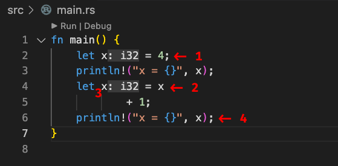

# rust variables

[https://www.youtube.com/watch?v=T_KrYLW4jw8&list=PLzMcBGfZo4-nyLTlSRBvo0zjSnCnqjHYQ&index=1](https://www.youtube.com/watch?v=T_KrYLW4jw8&list=PLzMcBGfZo4-nyLTlSRBvo0zjSnCnqjHYQ&index=1)

## Name Shadowing

*Name Shadowing* funciona com imutáveis num dado escopo.

Consider o exemplo (`cat src/main.rs`):

```rust
fn main() {
    let x = 4;
    println!("x = {}", x);
    let x = x
            + 1;
    println!("x = {}", x);
}
```

Eu separei o comando de atribuição nas linhas 4 e 5 para ilustrar o *Shadowing* claramente.



1. Uma *immutable* `x` é declarada e a ela atribui-se o valor 4. O Rust faz inferencia de tipo e o VSCode mostra o tipo default escolhida i32
2. A variavel `x` apontada é a *immutable* original com valor 4.
3. Uma nova *immutable* com o mesmo nome assume o valor 5 pela operação de atribuição.
4. O valor da nova *immutable* é apresentada no `stdout`.

Ainda sobre *Shadowing*:

```rust
fn main() {
    let x = 4;
    println!("x = {}", x);

    {
        let x = 2;
        println!("x = {}", x);
    }

    let x = x + 1;
    println!("x = {}", x);
}
```

O código nas linhas 5,6,7 e 8 executam num outro escopo devido aos caracteres `{` e `}`

```bash
cargo run src/main.rs  2> /dev/null
```

Apresenta a saída abaixo no Terminal.

```txt
x = 4
x = 2
x = 5
```

Vamos complicar mais um pouquinho:

```rust
fn main() {
    let x = 4;
    println!("x = {}", x);

    {
        let x = x + 5;
        println!("x = {}", x);
    }

    let x = x + 1;
    println!("x = {}", x);
}
```

```bash
cargo run src/main.rs  2> /dev/null
```

Apresenta a saída abaixo no Terminal.

```txt
x = 4
x = 9
x = 5
```

Veja que o valor `x` do primeiro *immutable* foi usado como entrada no escopo interior na linha 6 do programa.

## Immutables são conceitos diferentes de Constantes

Para ilustrar esta informação veja:

```rust
fn main() {
    const SECONDS_IN_MINUTE:u8 = 60;
    println!("SECONDS_IN_MINUTE = {}", SECONDS_IN_MINUTE);

    const SECONDS_IN_MINUTE:u16 = 60;
    println!("SECONDS_IN_MINUTE = {}", SECONDS_IN_MINUTE);
}
```

No caso de declaração de constantes somos obrigados a definir o tipo. Não há inferencia de tipo neste caso. Além disso a redefinição da constante na linha 5 é proibida. Veja o erro exibido quando tentamos rodar o programa:

```bash
cargo run src/main.rs
```

```txt
`SECONDS_IN_MINUTE` redefined here
   |
   = note: `SECONDS_IN_MINUTE` must be defined only once in the value namespace of this block
```

## Usando Linter no Rust

Instalando:

```bash
rustup component add clippy
```

Usando:

```bash
cargo clippy
```

Você verá todas as dicas de warnings e erros existentes no programa.
